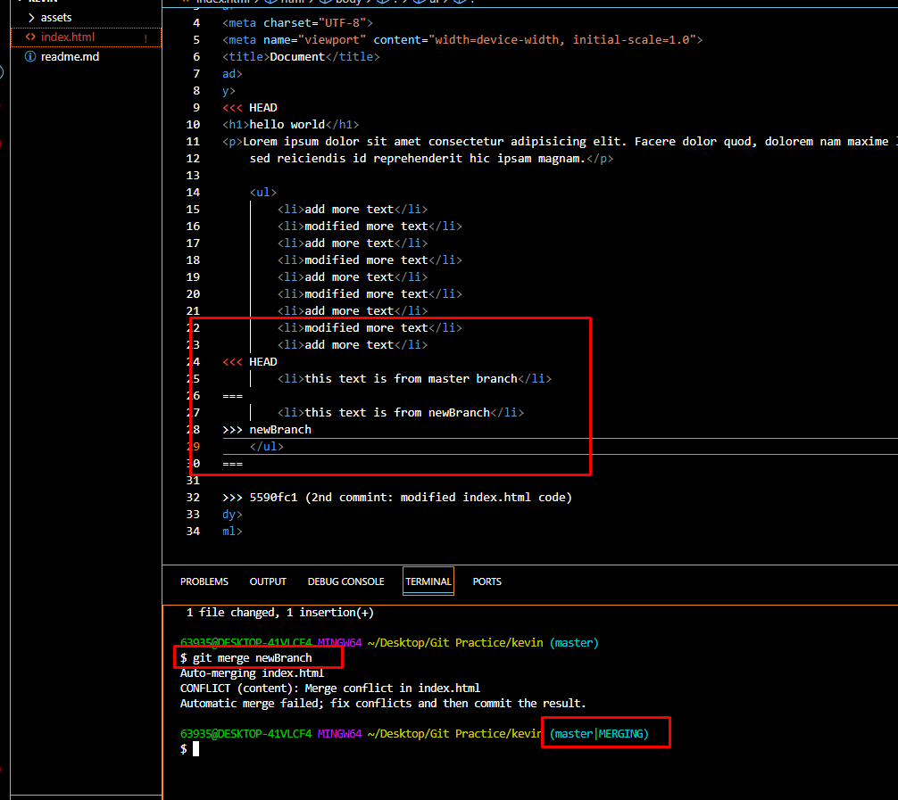
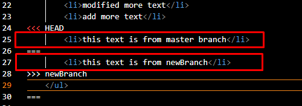
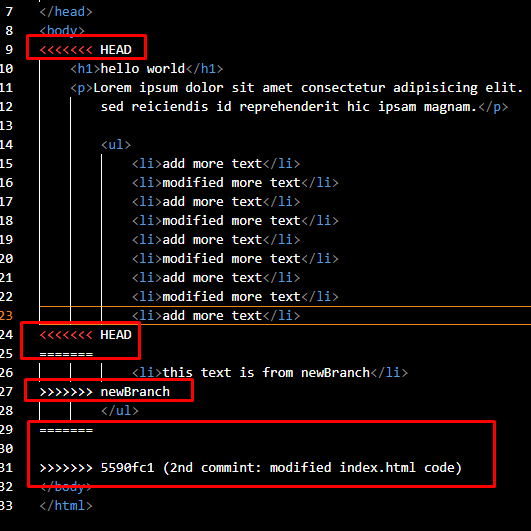

# Git Fundamentals
***

#### Reference

[How to Undo Mistakes With Git Using the Command Line](https://www.youtube.com/watch?v=lX9hsdsAeTk)

[Git for Professionals Tutorial](https://www.youtube.com/watch?v=Uszj_k0DGsg)

[Advanced Git Tutorial](https://www.youtube.com/watch?v=qsTthZi23VE)

***

### 0. Bash Commands

`rm -rf folderName` - delete completely the file or folder

`cd` - change directory

`la` - list everything, even hide folders and files

### 1. Git Configurations

`git --version` - to checks if git is installed

`git config --list` - list all configuration

`git config --global user.name "Josh"` - set repo user's name ( globally )

`git config --global user.email mercado@gmail.com` - set repo user's email ( globally )

`git config --global init.default branch main` - set repo default branch name to **main**

`git config --global credential helper 'cache --timeout=3600'` - remembers the credentials for 1 hour

`git config user.name` - output the user's name

`git config user.email` - output the user's email

### 1.1 .gitignore file

`index.html` - a single file

`src/*` - all the files inside **src** folder

`!src/style.css` - to exempt a file from **src/***

`*.zip` - all .zip files

`# comment` - write your comment

### 2. Git Workflow

`! git init` - initialize a new repo

`! git status` - checks the files if added, modified in the repo

`git status -s` - short version of **git status**

***

`git add --add` - same with ( **git add .** )

`git add -A` - same with ( **git add .** )

`! git add .` - preferred method of staging all files

`git add index.html` - staging one file

`git mv "oldfilename.txt" "newfilename.txt"` - renames file

`git diff` - find difference in staging file and working directory

`git diff branchName` - find difference in staging file and working directory

`git rm --cached index.html` - to remove / unstaged / delete the file you dont want to track completely

***

`! git commit -m "initial index commit"` - working area folder to staging area

`git commit -m "rename message" --amend` - rename the last git log message

> **WARNING:**

    `--amend` rewrites history, don't change commits that are already pushed to the remote repo

`git commit -a -m "commit untracked index.html"` - commit with untracked files, bypassing the staging area

***

`! git log` - standard log messages

`! git log --oneline` - one liner logs

`git log -p` - logs with detailed information

***

#### Undoing Mistakes

`git reflog` - starts at the recent commit changes

#####  Recovering lost / deleted logs

1. `git reflog` - starts at the recent commit changes

2. `git branch newBranch 67ae8bf` - create a branch that will contain deleted logs BEFORE the target hash commit number got from ***git reflog*

#####  Recovering deleted branch

1. get the name of the deleted branch

2. use `git reflog` to find the hash commit number before the commit that deletes the branch

3. type `git branch feature/branchName 67ae8bf` - to restore the branch

#####  Moving commit to another branch ( e.g master accidentally commit instead of feature/login )

1. `git branch feature/login`

2. `git reset HEAD~1 --hard`

`git restore --source 67ae8bf index.html` - resetting the file to its old revision ( target hash number )

`git restore --staged index.html` - degrade file from staging area to working directory ( green to red )

`git restore "index.html"` - discard all changes / restore deleted file

`git restore -p index.html` - selects which hunk of changes in the file you want to discard

`git restore .` - undone everything

`git reset HEAD~1` - undo last commit changes

`git reset index.html` - unstaged this file

`git reset 67ae8bf` - unstages files / to go back to this commit number ( 67ae8bf - sample hash number )

`git reset --hard 67ae8bf` - unstages& removes files / to go back to this commit number ( 67ae8bf - sample hash number ) and deletes commits AFTER the target hash commit

    `--hard` - means no local changes should survive

    `--mixed` - deletes commits but retains the changes from the deleted commits made

`! git revert 67ae8bf` - to revert back to previous changes BEFORE the target hash commit number; creates a commit message that you should **git push** after

#### Reverting only a file without affecting other commit changes

##### Scenario

* suppose you have 3 commits with this setup:

1. commit "deleted some text from index.html" ( 3rd commit: hash 1234 )
    
    * deleted some text from index.html
    * `git add index.html`
    * `git commit` 

2. commit "added text from src/style.css" ( 2nd commit: hash 5678 )
    
    * edit style.css
    * `git add style.css`
    * `git commit` 

2. commit "added text from .license" ( latest: 1st commit: hash 9012 )
    
    * edit .license
    * `git add .license`
    * `git commit` 

* and then you want to revert 3 commits ( without knowing thier hash commits ) bring back the deleted text :

##### To fix the issue

`HEAD` - the current location of the repository

`git revert HEAD~3` - revert only the files INCLUDED in that commit

`git revert HEAD~5..HEAD~1` ( git revert [old/start commit]..[new/end commit] ) - to include ALL the commits between the HEAD

> **NOTE:**

    avoid reverting commits all at once, for it can introduce errors for missing files. its better to revert one by one

***

### 3. Branch

`! git branch branchName` - create branch

`! git branch` - list all branches ( *currentBranch )

`git branch --list` - list all branches ( *currentBranch )

`! git switch branchname` - to switch branch

`git checkout branchname` - to switch branch

`! git switch -c branchName` - create a branch and switch with it asap

`git checkout -b branchName` - create a branch and switch with it asap

`git branch -d branchName` - delete branch

***

#### Merging Branch ( merge from "main" branch with another branch )

1. `git switch main` - go back to "main" branch
2. `git merge branchname` - merge the branchName
3. `git merge -m "merge branchName back to main" branchName` - merge main with another branch with commit message

#### Merging Conflict

##### Scenario

* suppose you have 2 branches and did the following:

1. featureBranch
    
    * edit `index.html` - same file from 'main' branch
    * `git add .`
    * `git commit` 

2. mainBranch
    
    * edit `index.html` - original file
    * `git add .`
    * `git commit` 

* and then you did this:

    1. `git switch mainBranch` - go back to main branch
    2. `git merge -m "merge featureBranch back to main" featureBranch` - tried to merge featureBranch
= since featureBranch and mainBranch edited and commited a same file; it will result to **merge conflict**

##### To fix the issue

1. in the affected file under main branch, a guideline text will appear within the file

    

2. Choose which text you want to delete

    

3. delete unnecessary characters

    

***

### 3. Pushing Content files from local repo to target remote repo

1. create a remote public repo from github website

2. copy its HTTPS link e.g `https://github.com/mercado-joshua/kevin-git.git`

3. `git remote add origin https://github.com/mercado-joshua/kevin-git.git` - to establish remote connection to github

4. `git branch -M main` - set the target branch to main

5. `git pull` - fetch and merges files from the remote repo to your local repo

6. `git push -u origin main` - push all the local contents to the remote repo

#### Failed Upload

##### Scenario

1. remote repo
    
    * has `license.txt`

2. local repo
    
    * no `license.txt`

= since the remote and the local repo not in sync with each other; causing the uploading failed

##### To fix the issue

1. `git branch --set-upstream-to=origin/main`

2. `git pull --allow-unrelated-histories`

3. `git push -u origin main`

`git push` - push all local content to remote repo

`git push --all` - to push all branches to remote repo

`! git pull` - combination of git fetch + git merge

`git remote -v` - checks the connection if setup correctly

`! git fetch origin` - to get branches created from the remote repo to your local repo

`! git fetch origin branchname:branchName` - to get a single branch created from the remote repo to your local repo

`! git push -u origin branchName` - push changes from your local branch to the remote branch repo

***
### Writing Git Commits

1. `git commit`

2. **Subject** : concise summary of what happened

    **Body** : more detailed explanation

        - what is now different than before?
        - what's the reason for the change?
        - anything to watch-out for? or something remarkable?

3. choose type of commit message

        feat: the new feature you're adding to a particular application

        fix: a bug fix

        style: feature and updates related to styling

        refactor: refactoring a specific section of the codebase

        test: everything related to testing

        docs: fverything related to documentation

        chore: regular code maintenance

### Branch Stategies

1. branch name workflow 
        
        Long-lived - no direct commits unless integration ( merge / rebase )
        Short-lived - for features, bug fixes, refactoring. will be deleted after integration

    - main / master ( long-lived )
    - develop ( long-lived )
    - features ( short-lived )

