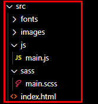
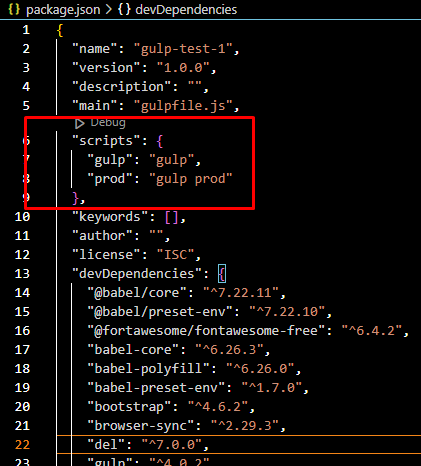
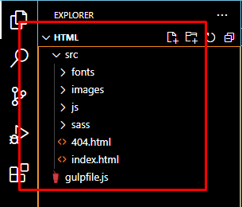

# Gulp Project Setup Version 0.3

There are lots of tutorial that you can find in the internet which makes it difficult to choose what's best for you, as for me, this is the final (for now) gulp setup that I created that works for me at the moment. I created this guide if ever I forget doing it or if someone find my setup beneficial to them. *It's better to have a backup* after all.


## 1. Prerequisite

* vscode terminal.

* node.js

    LINK: https://www.pluralsight.com/guides/getting-started-with-nodejs

* git bash

    LINK: https://git-scm.com/download/win

* let "git bash" be the default terminal of VSCODE

    LINK: https://www.geeksforgeeks.org/how-to-integrate-git-bash-with-visual-studio-code/


## 2. Plugin Installation

1. Inside of your project folder, open your terminal and type `npm init -y` to generate a `package.json` file.

2. In your vscode terminal type/copy this command and press enter. (*see code below*)

`
npm i -D gulp gulp-cli sass gulp-sass gulp-postcss autoprefixer gulp-clean-css gulp-terser browser-sync bootstrap jquery @fortawesome/fontawesome-free gulp-babel babel-preset-env babel-core @babel/core @babel/preset-env babel-polyfill
`

**Note:** this ends the installation part, you may proceed to the next section or if you want explanation about the plugins, feel free to read it.

1. we will add all of the plugins as dev dependencies.

> npm i -D

2. this plugins are related to gulp.

> gulp gulp-cli sass gulp-sass gulp-autoprefixer gulp-clean-css gulp-terser browser-sync

3. setup vendors.

> bootstrap jquery @fortawesome/fontawesome-free@next

4. setup babel.

> gulp-babel babel-preset-env babel-core @babel/core @babel/preset-env babel-polyfill


## 3. Project Folder Setup

follow this project's folder structure. (**create only the files that are within the red box**)



## 4. Gulp Configuration File

1. In your project's root directory, create a `gulpfile.js`.

2. In your gulpfile.js, copy and paste this code. (*see code below*)

```javascript
/**
 * npm init -y
 * 
 * npm i -D gulp gulp-cli sass gulp-sass gulp-postcss autoprefixer gulp-clean-css gulp-terser browser-sync bootstrap jquery @fortawesome/fontawesome-free gulp-babel babel-preset-env babel-core @babel/core @babel/preset-env babel-polyfill
 */
/**
 * import the required plugins
 */


/**
 * SASS and CSS plugins
 */

/// enables sass
const sass = require( "gulp-sass" )( require( "sass" ) );

// add vendor prefixes to new css properties
const postcss = require( "gulp-postcss" );
const autoprefixer = require( "autoprefixer" );

// minifies css stylesheets
const minify = require( "gulp-clean-css" );


/**
 * JS plugins
 */

// converts your ES6 js code into ES5
const babel = require( "gulp-babel" );

// minifies js scripts
const terser = require( "gulp-terser" );


/**
 * utilities plugins
 */

// enables gulp functionalities
const gulp = require( "gulp" );

// deals with browser reloading
const browserSync = require( "browser-sync" ).create();


/**
 * paths and configuration setup
 */

const paths = {
    jquery: "./node_modules/jquery/dist/jquery.min.js",
    polyfill: "./node_modules/babel-polyfill/dist/polyfill.min.js",
    bootstrap: {
        sass: "./node_modules/bootstrap/scss/bootstrap.scss",
        js: "./node_modules/bootstrap/dist/js/bootstrap.bundle.min.js"
    },
    fontawesome: {
        sass: "./node_modules/@fortawesome/fontawesome-free/scss/fontawesome.scss",
        js: "./node_modules/@fortawesome/fontawesome-free/js/all.min.js"
    },
    fonts: {
        source: "./src/fonts/**/**.*",
        destination: "./dist/fonts"
    },

    images: {
        source: "./src/images/**/**.*",
        destination: "./dist/images"
    },
    html: {
        source: "./src/*.html",
        destination: "./dist"
    },
    sass: {
        source: "./src/sass/**/*.scss",
        destination: "./dist/css"
    },
    css: {
        source: "./dist/css/**/*.css",
        destination: "./dist/css"
    },
    js: {
        source: "./src/js/**/*.js",
        destination: "./dist/js"
    },
    jsMinify: {
        source: "./dist/js/**/*.js",
        destination: "./dist/js"
    }
};

// create list of stylesheets
const listOfStyles = [ 
    paths.bootstrap.sass, 
    paths.fontawesome.sass, 
    paths.sass.source 
];

// create list of js scripts
const listOfJSVendor = [
    paths.bootstrap.js, 
    paths.fontawesome.js, 
    paths.jquery, 
    paths.polyfill
];

// configuration for browsers
const config = {
    browserList: {
        overrideBrowserslist: [
        "> 1%",
        "ie >= 8",
        "edge >= 15",
        "ie_mob >= 10",
        "ff >= 45",
        "chrome >= 45",
        "safari >= 7",
        "opera >= 23",
        "ios >= 7",
        "android >= 4",
        "bb >= 10"
    ]},
    babel: {
        presets: [ "@babel/preset-env" ]
    },
    browserSync: {
        server: {
            baseDir: "./dist",
            notify: false,
            open: false
        }        
    }
};

// configuration for sourcemaps
const sourcemap = {
    css: {
        enable: true,
        path: "./sourcemaps"
    },
    js: {
        enable: true,
        path: "./sourcemaps"
    }
};


/**
 * tasks for code development
 */

/** [1] compiles bootstrap and custom sass to css */
gulp.task( "build:sass", function() {
    return gulp.src( listOfStyles )
        .pipe( sass().on( "error", sass.logError ))
        .pipe( postcss([
            autoprefixer( config.browserList )
        ]))
        .pipe( gulp.dest( paths.sass.destination ));
});

/** [2] compiles js vendors */
gulp.task( "build:vendor", function() {
    return gulp.src( listOfJSVendor )
        .pipe( gulp.dest( paths.js.destination ));
});

/** [3] transforms custom js into ES5 */
gulp.task( "build:js", function() {
    return gulp.src( paths.js.source )
       .pipe( babel({ presets: [ "@babel/preset-env" ] }))
       .pipe( gulp.dest( paths.js.destination ) );
});

/** [4] copies html from .src to .dist */
gulp.task( "build:html", function() {
    return gulp.src( paths.html.source )
        .pipe( gulp.dest( paths.html.destination ));
});

/** [4.1] copies html from .src to .dist */
gulp.task( "build:images", function() {
    return gulp.src( paths.images.source )
        .pipe( gulp.dest( paths.images.destination ));
});

/** [4.2] copies html from .src to .dist */
gulp.task( "build:fonts", function() {
    return gulp.src( paths.fonts.source )
        .pipe( gulp.dest( paths.fonts.destination ));
});

/** [5] starts live serve */
gulp.task( "build:serve", function( cb ) {
    browserSync.init( config.browserSync );
    cb();
});

/** [6] reloads the webpage */
gulp.task( "build:reload", function( cb ) {
    browserSync.reload();
    cb();
});

/** [7] watch task for ./src files */
gulp.task( "build:watch", function() {
    gulp.watch(
        [ paths.images.source, paths.fonts.source, paths.html.source, paths.sass.source, paths.js.source ],
        gulp.series([ "build:images", "build:fonts", "build:html", "build:sass", "build:js", "build:reload" ])
    );
});


/**
 * tasks for code deployment
 */

/** [1] minifies css and generate a sourcemap */
gulp.task( "prod:css", function() {
    return gulp.src( listOfStyles, { sourcemaps: sourcemap.css.enable })
        .pipe( sass().on( "error", sass.logError ))
        .pipe( prefix( config.browserList ))
        .pipe( minify() )
        .pipe( gulp.dest( paths.css.destination, { sourcemaps: sourcemap.css.path }));
});

/** [2] minifies js and generate a sourcemap */
gulp.task( "prod:js", function() {
    return gulp.src( paths.jsMinify.source, { sourcemaps: sourcemap.js.enable })
        .pipe( terser() )
        .pipe( gulp.dest( paths.jsMinify.destination, { sourcemaps: sourcemap.js.path }));
});


/**
 * console gulp commands
 */

/**
 * REMINDER!
 *     Add this script to the "package.json" file before
 *     using below commands:
 * 
       "scripts": {
            "gulp": "gulp",
            "prod": "gulp prod"
       }
 */

/** [1] run "npm run gulp" on terminal: when developing a site */
gulp.task( "default", gulp.parallel( 
    "build:sass", "build:vendor", "build:js", "build:images", 
    "build:fonts", "build:html", "build:serve", "build:watch"
));

/** [2] run "gulp prod" on terminal: when deploying the site */
gulp.task( "prod", gulp.parallel(
    "prod:css", "prod:js"
));


```
## 4. Add "script" object to the `package.json` file

Go to `package.json` and add this script.



* on your terminal, type `npm run gulp` or `npm run prod`. 

## 5. Edit `index.html` file in `src/` folder

```html
<head>
  <meta charset="utf-8">
  <title></title>
  <meta name="description" content="your website's description">
  <meta name="viewport" content="width=device-width, initial-scale=1">

  <!-- control how URLs are displayed when shared on social media -->
  <meta property="og:title" content="">
  <meta property="og:type" content="website">
  <meta property="og:url" content="">
  <meta property="og:image" content="">

  <!-- https://realfavicongenerator.net/ -->
  <link rel="icon" href="/favicon.ico" sizes="any">
  <link rel="apple-touch-icon" href="icon.png">

  <link rel="stylesheet" href="css/bootstrap.css">
  <link rel="stylesheet" href="css/fontawesome.css">
  <link rel="stylesheet" href="css/main.css">

  <meta name="theme-color" content="#fafafa">
</head>

<body>
  <!-- Add your site or application content here -->
  <p>Hello world! This is HTML5 Boilerplate.</p>
  <script src="js/bootstrap.bundle.min.js"></script>
  <script src="js/all.min.js"></script>
  <script src="js/jquery.min.js"></script>
  <script src="js/polyfill.js"></script>
  <script src="js/main.js"></script>
</body>

</html>
```


and that's it! you're done now, happy coding. 


